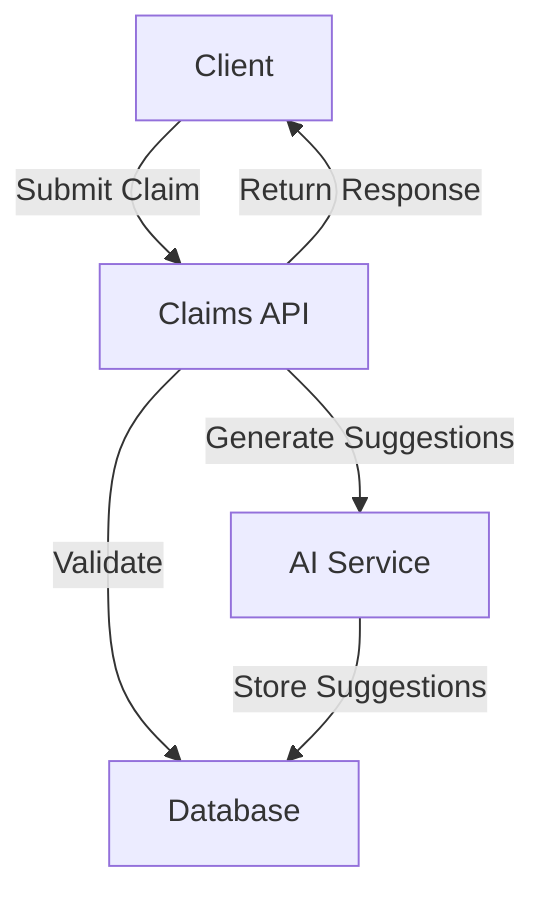
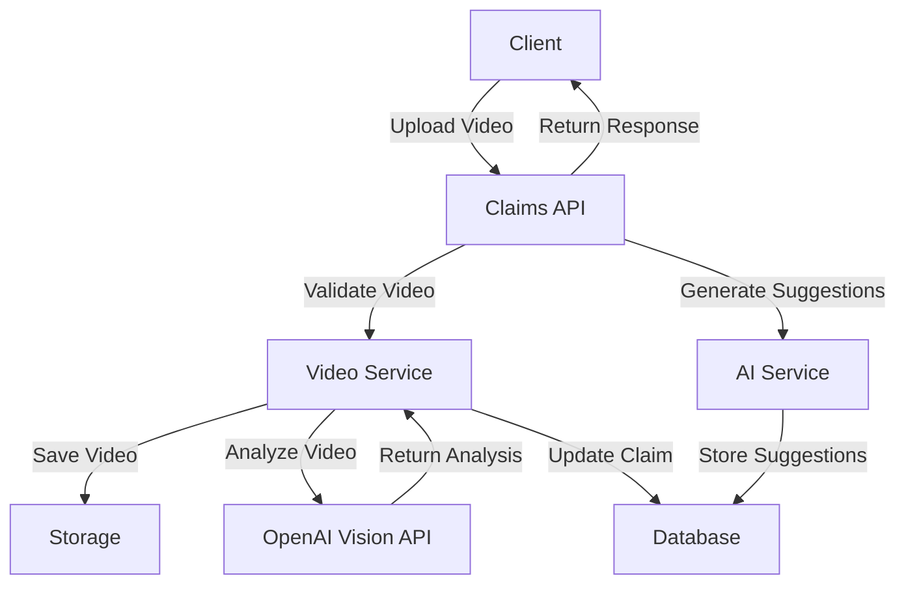
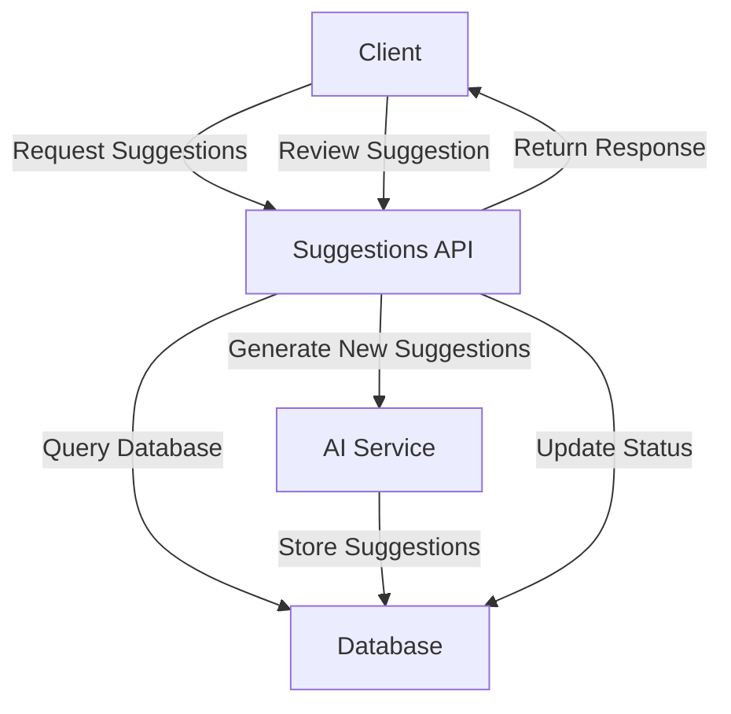

# Insurance Claims Processing Platform - Architecture Documentation

## Overview
The Insurance Claims Processing Platform is a modern API-based system that handles insurance claims processing with AI-powered suggestions and video analysis capabilities. This document provides a comprehensive guide to the system's architecture, data flow, and key components.

## System Architecture

### Core Components

1. **API Layer**
   - FastAPI-based REST API
   - Organized into modular routes
   - Comprehensive request validation
   - Detailed API documentation

2. **Service Layer**
   - Business logic implementation
   - External service integration
   - Data processing and analysis

3. **Data Layer**
   - SQLAlchemy ORM
   - PostgreSQL database
   - Data models and schemas

4. **AI Integration**
   - OpenAI API integration
   - Video analysis capabilities
   - Suggestion generation

## Data Flow

### 1. Claim Creation and Management



#### Steps:
1. Client submits claim data
2. API validates input
3. Claim is stored in database
4. AI service generates initial suggestions
5. Response returned to client

### 2. Video Upload and Analysis



#### Steps:
1. Client uploads video
2. Video service validates file
3. Video is saved to storage
4. OpenAI Vision API analyzes video
5. Analysis results stored with claim
6. AI service generates new suggestions
7. Response returned to client

### 3. Suggestion Management



#### Steps:
1. Client requests suggestions
2. API retrieves existing suggestions
3. AI service generates new suggestions if needed
4. Client reviews suggestions
5. Review status is updated
6. Metrics are calculated

## API Endpoints

### Claims API (`/claims`)

1. **Create Claim** (`POST /claims`)
   - Submit new insurance claim
   - Required fields: policy details, loss information
   - Returns: Created claim with ID

2. **Get Claim** (`GET /claims/{claim_id}`)
   - Retrieve specific claim details
   - Returns: Complete claim information

3. **List Claims** (`GET /claims`)
   - List all claims with filtering
   - Filters: status, policyholder name
   - Pagination support

4. **Update Claim** (`PATCH /claims/{claim_id}`)
   - Update claim status or details
   - Returns: Updated claim

5. **Upload Video** (`POST /claims/{claim_id}/upload_video`)
   - Upload claim-related video
   - Triggers AI analysis
   - Returns: Generated suggestions

### Suggestions API (`/suggestions`)

1. **Generate Suggestions** (`POST /suggestions/claims/{claim_id}/suggestions`)
   - Generate AI-powered suggestions
   - Returns: List of suggestions

2. **List Suggestions** (`GET /suggestions/claims/{claim_id}/suggestions`)
   - Get all suggestions for a claim
   - Filter by status

3. **Get Suggestion** (`GET /suggestions/{suggestion_id}`)
   - Get specific suggestion details

4. **Review Suggestion** (`POST /suggestions/{suggestion_id}/review`)
   - Review and update suggestion status
   - Options: accept, reject, modify

5. **Get Metrics** (`GET /suggestions/metrics`)
   - Get suggestion statistics
   - Includes acceptance rates

## Data Models

### Claim
- Unique identifier
- Policy information
- Loss details
- Status tracking
- Timestamps
- Video analysis results

### Suggestion
- Unique identifier
- Claim reference
- Type and confidence
- Explanation
- Suggested action
- Review status
- Timestamps

## Error Handling

The system implements comprehensive error handling:
- Input validation
- Database errors
- External service failures
- File processing errors
- Authentication/Authorization

## Testing

The application includes:
- Unit tests for services
- API endpoint tests
- Integration tests
- Mock external services

Run tests with:
```bash
pip install -r requirements-test.txt
pytest tests/ -v --cov=app
```

## Security Considerations

1. **API Security**
   - Input validation
   - Rate limiting
   - Authentication (to be implemented)
   - Authorization (to be implemented)

2. **File Security**
   - File type validation
   - Size limits
   - Secure storage

3. **Data Security**
   - Database encryption
   - Secure API keys
   - Data validation

## Deployment

The application can be deployed using:
1. Docker containerization
2. Cloud platform (AWS, GCP, Azure)
3. Traditional server deployment

## Monitoring and Logging

1. **Application Metrics**
   - Request counts
   - Response times
   - Error rates

2. **Business Metrics**
   - Claim processing times
   - Suggestion acceptance rates
   - Video analysis success rates

## Future Enhancements

1. **Planned Features**
   - User authentication
   - Role-based access control
   - Advanced analytics
   - Mobile app integration

2. **Potential Improvements**
   - Real-time notifications
   - Batch processing
   - Advanced AI models
   - Additional file type support 